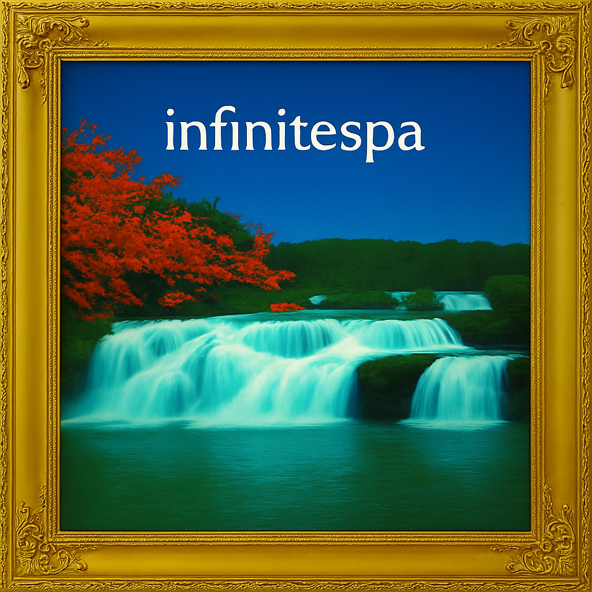

# Infinite Spa Music Generator



A procedural music generator that creates relaxing spa music with harmonically sensible chord progressions and melodies. **Experience infinite bliss and relaxation directly in your terminal** with soothing sounds and ambient backgrounds.

## Overview

The Infinite Spa Music Generator provides a complete relaxation experience by combining:

- Procedurally generated music with smooth voice-leading chord progressions
- Complementary melodic lines that enhance the relaxation experience
- Optional ambient nature sounds for a fully immersive environment
- FluidSynth integration for high-quality audio playback

Simply run the provided shell script and transform your workspace into a tranquil spa environment while you work, read, or meditate.

## Features

- Generates harmonically coherent chord progressions using voice-leading principles
- Creates melodic lines that complement the chord progression
- Uses music theory principles (scales appropriate to each chord type)
- Implements weighted note selection favoring chord tones
- Includes various rhythmic patterns with rests for musical variety
- Maintains voice leading between chord changes
- Supports MIDI file creation and playback
- FluidSynth integration for real-time audio playback
- Command-line interface with various options
- Shell scripts for easy startup and shutdown

## Package Structure

The codebase is organized into the following modules:

- `harmony.py` - Chord structures, functions, weights
- `generator.py` - Chord generation & voicing
- `melody.py` - Melody generation
- `midi_utils.py` - MIDI file creation and playback
- `main.py` - CLI / demo script

## Installation

1. Clone the repository:
   ```
   git clone <repository-url>
   cd infinite-spa
   ```

2. Create and activate a virtual environment:
   ```
   python -m venv venv
   source venv/bin/activate  # On Windows: venv\Scripts\activate
   ```

3. Install the required dependencies:
   ```
   pip install -r requirements.txt
   ```

4. (Optional) Install FluidSynth for real-time audio playback:
   - On macOS: `brew install fluidsynth`
   - On Linux: `sudo apt-get install fluidsynth`
   - On Windows: Download from [FluidSynth website](https://www.fluidsynth.org/)

5. Download a SoundFont file for FluidSynth:
   - The GeneralUser GS SoundFont is recommended and can be downloaded from: [https://schristiancollins.com/generaluser.php](https://schristiancollins.com/generaluser.php)
   - Place the downloaded .sf2 file in a location referenced by your `run_spa_music.sh` script

## Usage

### Quick Start with Shell Scripts

The easiest way to enjoy the Infinite Spa experience is using the provided shell scripts:

1. Start the spa music and ambient sounds:
   ```
   ./run_spa_music.sh
   ```
   This will start FluidSynth, play ambient sounds (if available), and generate infinite relaxing music.

2. To stop all audio processes:
   ```
   ./stop_spa_music.sh
   ```
   This will cleanly terminate all audio processes and close any related terminal windows.

### Running the Python Script Directly

Run the generator with default settings:

```
python run_infinite_spa.py
```

### Command-line Options

- `--key [0-11]`: Key to generate in (0=C, 1=C#, etc.)
- `--chords [number]`: Number of chords to generate (default: 16)
- `--tempo [bpm]`: Tempo in BPM (default: 70)
- `--instrument [0-127]`: MIDI instrument for chords (default: 11 - Vibraphone)
- `--melody-instrument [0-127]`: MIDI instrument for melody (default: 73 - Flute)
- `--seed [number]`: Random seed for reproducibility
- `--no-open`: Don't open MIDI player automatically
- `--infinite`: Generate and play music infinitely (Ctrl+C to stop)

Example:
```
python run_infinite_spa.py --key 0 --chords 12 --tempo 65 --instrument 0 --melody-instrument 73
```

## How It Works

The generator uses several key components:

1. **Voice-Leading Chord Generator**: Creates chord progressions that follow functional harmony rules and voice-leading principles.

2. **Melody Generator**: Builds melodic lines based on the underlying chord structure, using appropriate scales for each chord type.

3. **MIDI Utilities**: Handles the creation of MIDI files and playback through FluidSynth or the default MIDI player.

The chord progression plays arpeggiated eighth notes in 3/4 time, with each chord arpeggiated and followed by a rest before the next chord begins. The melody provides complementary musical interest with a mix of notes and rests for a more natural, less constant sound.

## License

[MIT License](LICENSE)
